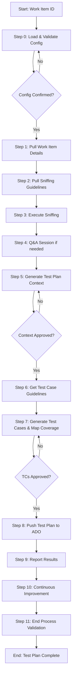

# Process: Create Test Plan for Work Item {{workItemId}}

**Template**: create-test-plan
**Status**: Not Started

## Description

Create comprehensive ADO test plans for backend work items. Loads team config, fetches work item details, runs sniffing checklists with code cross-reference, generates test cases following guidelines, maps against existing coverage, and pushes approved test cases to Azure DevOps.

## Purpose & Usage

Use this template when you need to:
- Create a test plan for an ADO work item
- Generate test cases with code-informed sniffing
- Map new test cases against existing coverage (new/update/skip/obsolete)
- Push test cases to ADO with proper suite and linking

**Not suitable for**: Unit test creation (code-level), manual exploratory testing, or non-backend work items.

## Quick Reference

| Parameter | Required | Description |
|-----------|----------|-------------|
| `workItemId` | Yes | Azure DevOps work item ID |

## Process Flow

## Steps Summary

| Step | Name | Approval |
|------|------|----------|
| 0 | Load & Validate Config | Yes |
| 1 | Pull Work Item Details | No |
| 2 | Pull Sniffing Guidelines | No |
| 3 | Execute Sniffing | No |
| 4 | Q&A Session (if needed) | No |
| 5 | Generate Test Plan Context | Yes |
| 6 | Get Test Case Guidelines | No |
| 7 | Generate Test Cases & Map Coverage | Yes |
| 8 | Push Test Plan to ADO | No |
| 9 | Report Results | No |
| 10 | Continuous Improvement | Yes |
| 11 | End Process Validation | No |
