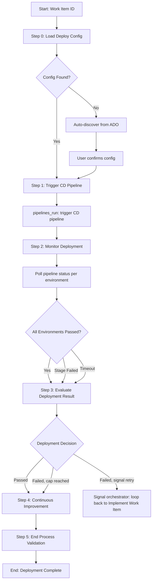

# Process: Deploy to Testing Environments {{workItemId}}

**Template**: deploy-to-testing
**Status**: Not Started

## Description

Deploy build artifacts to testing environments via a CD/release pipeline. Loads pipeline configuration from `.ai/deploy-config.json` (cd section), actively triggers the CD pipeline, monitors deployment progress across target environments, and evaluates the result. On failure, signals the parent SDLC orchestrator to loop back to the Implement Work Item step for a code fix, with a configurable retry cap.

## Purpose & Usage

Use this template when you need to:
- Deploy a build to testing environments (e.g., QA, Sandbox) after CI passes
- Trigger and monitor a CD/release pipeline in Azure DevOps
- Handle deployment failures with structured retry loops back to implementation

**Not suitable for**: Production deployments, CI-only verification (use verify-ci-pipeline), or manual deployment processes.

## Quick Reference

| Parameter | Required | Description | Default |
|-----------|----------|-------------|---------|
| `workItemId` | Yes | Azure DevOps work item ID | -- |
| `maxDeploymentRetries` | No | Max deployment failure -> fix iterations | 3 |

## Process Flow



## Config Schema: `.ai/deploy-config.json` (cd section)

The CD pipeline configuration is stored alongside CI configuration in the repo's `.ai/deploy-config.json` file.

```json
{
  "ado_project": "Payoneer",
  "ci": { "..." : "..." },
  "cd": {
    "pipeline_definition_id": 67890,
    "pipeline_name": "my-service-CD",
    "target_environments": ["QA", "SB"],
    "timeout_minutes": 20,
    "poll_interval_seconds": 30,
    "source_branch": null
  }
}
```

| Field | Required | Description | Default |
|-------|----------|-------------|---------|
| `cd.pipeline_definition_id` | Yes | CD/release pipeline definition ID (single pipeline with environment stages) | -- |
| `cd.pipeline_name` | No | Pipeline name (for display/matching) | -- |
| `cd.target_environments` | Yes | Ordered array of environment stage names to deploy to sequentially | -- |
| `cd.timeout_minutes` | No | Max wait time per environment stage | 20 |
| `cd.poll_interval_seconds` | No | Polling interval between status checks | 30 |
| `cd.source_branch` | No | Branch to deploy from | Current branch |

**Payoneer standard**: The deployment order is QA -> SB (sandbox), sequential. The `target_environments` array controls how far deployment reaches:
- `["QA"]` -- deploy to QA only (default for most repos)
- `["QA", "SB"]` -- deploy to QA first, then SB if QA succeeds

## Key Behaviors

- **Config-driven**: All pipeline settings come from `.ai/deploy-config.json` with auto-discovery fallback
- **Active triggering**: Unlike CI (auto-triggered by push), CD pipelines are actively triggered via `mcp__azuredevops__pipelines_run`
- **Sequential environments**: Deploys to environments in order; if an earlier stage fails, later stages are not attempted
- **Polling**: Monitors pipeline status at configurable intervals until terminal state or timeout
- **Failure extraction**: On failure, reads build logs to extract error details and categorize the failure
- **Retry signaling**: On failure, the sub-process signals the orchestrator to loop back to Implement Work Item for a fix

## Failure Categories

| Category | Description | Action |
|----------|-------------|--------|
| Deployment Error | Code/config issue causing deploy failure | Loop back for code fix |
| Environment Issue | Target environment unavailable or misconfigured | Loop back or manual intervention |
| Infrastructure Failure | Pipeline agent, network, or tooling failure | Retry or escalate |
| Timeout | Deployment exceeded timeout_minutes | Investigate and retry |

## Retry Decision Matrix

| Condition | Action |
|-----------|--------|
| Deployment passed all environments | Proceed to next orchestrator step |
| Deployment failed, retries < maxDeploymentRetries | Signal orchestrator: loop back to Implement Work Item (step 2) |
| Deployment failed, retries >= maxDeploymentRetries | Log warning, proceed to next orchestrator step |

## Relationship to SDLC Orchestrator

This sub-process is spawned by the SDLC orchestrator at step 3 ("Deploy to Testing Environments"). The orchestrator controls the retry loop:

- **`loopBackTo: 2`** (Implement Work Item): On CD failure, the orchestrator loops back to step 2 so the developer can fix the deployment issue in code, re-run CI, then attempt CD again.
- **`maxIterations: 3`**: Limits the deploy-fix cycle. After 3 failed attempts, the orchestrator proceeds to Run Test Suite regardless.
- **`syncPoint: "immediate"`**: The orchestrator waits for the sub-process to complete before proceeding.

## Steps Summary

| Step | Name | Approval | Loop |
|------|------|----------|------|
| 0 | Load Deploy Config | No | -- |
| 1 | Trigger CD Pipeline | No | -- |
| 2 | Monitor Deployment | No | -- |
| 3 | Evaluate Deployment Result | No | -- |
| 4 | Continuous Improvement | Yes | -- |
| 5 | End Process Validation | No | -- |

## Memory Fields

| Field | Description |
|-------|-------------|
| `deployConfig` | Resolved pipeline configuration from .ai/deploy-config.json |
| `cdPipelineRunId` | ID of the triggered CD pipeline run |
| `cdPipelineStatus` | Final pipeline status (passed/failed/canceled) |
| `cdFailureDetails` | Error messages, failing stages, logs (on failure) |
| `cdRetryIteration` | Current retry iteration number |
| `cdDecision` | Decision: proceed, retry, or cap-reached |
| `cdTargetEnvironments` | Ordered list of target environments and per-environment status |
