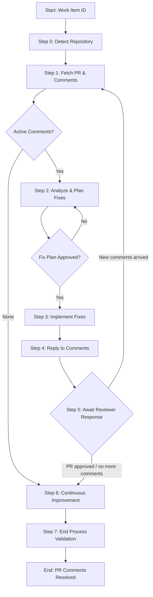

# Process: Fix PR Comments for Work Item {{workItemId}}

**Template**: fix-pr-comments
**Status**: Not Started

## Description

Iterative workflow to address PR review comments for a given Azure DevOps work item. Fetches active comments from the associated pull request, creates a fix plan, implements the fixes, replies to reviewers, and then **pauses** to wait for the next round of feedback. The process loops through review cycles until the PR is clean or the user decides to exit.

This template supports the real-world asynchronous nature of code review -- after fixing and replying to comments, the process pauses at Step 5 ("Await Reviewer Response") because new reviewer feedback may arrive hours or days later. The user resumes the process when ready, choosing to loop back for another cycle or exit.

## Purpose & Usage

Use this template when you need to:
- Address PR review comments systematically across multiple review cycles
- Track which comments have been fixed and replied to
- Handle iterative reviewer feedback without losing context between cycles

**Not suitable for**: Creating PRs (use implement-work-item), initial code reviews, or PRs without active comments.

## Quick Reference

| Parameter | Required | Description |
|-----------|----------|-------------|
| `workItemId` | Yes | Azure DevOps work item ID (used to find the associated PR) |

## Process Flow

## Steps Summary

| Step | Name | Approval | Notes |
|------|------|----------|-------|
| 0 | Detect Repository | No | One-time setup |
| 1 | Fetch PR and Comments | No | Entry point for each cycle |
| 2 | Analyze and Plan Fixes | Yes | Categorizes comments into fix plan |
| 3 | Implement Fixes | No | Commits and pushes code changes |
| 4 | Reply to Comments | No | Posts replies to PR threads |
| 5 | Await Reviewer Response | Yes | Pause-and-resume checkpoint; loops to Step 1 |
| 6 | Continuous Improvement | Yes | After all iterations complete |
| 7 | End Process Validation | No | Final compliance check |

## Iteration Model

Steps 1-5 form a loop. Each cycle addresses one round of reviewer feedback:

1. **Fetch** -- Pull latest PR comments from Azure DevOps
2. **Analyze** -- Categorize comments and create a fix plan (with approval gate)
3. **Fix** -- Implement the planned changes, commit, and push
4. **Reply** -- Post replies to each comment thread with fix status
5. **Pause** -- Wait for the reviewer to respond (process pauses here)

The loop exits when:
- No active comments remain on the PR
- The user decides the PR is approved / no more comments need addressing

## Notes

- Based on the fix-pr-comments skill workflow pattern from csm-ai-agent
- Self-contained template -- does not depend on the original skill file
- First-iteration early exit: if no active comments exist on the first fetch, the process skips directly to Continuous Improvement
