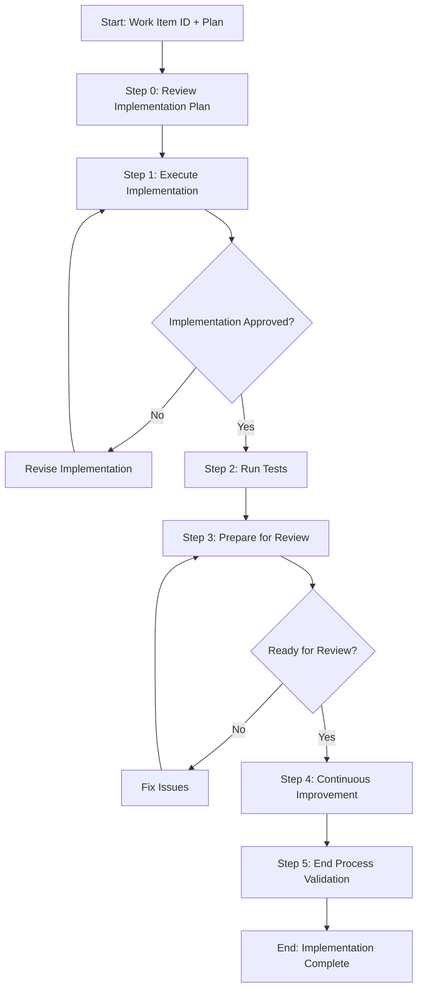

# Process: Implement Work Item {{workItemId}}

**Template**: implement-work-item
**Status**: Not Started

## Description

Implement an Azure DevOps work item based on an approved implementation plan. Reviews the plan, executes code changes following the plan's step order, runs tests to verify no regressions, and prepares clean commits for review.

## Purpose & Usage

Use this template when you need to:
- Implement code changes for an ADO work item based on an existing plan
- Follow a structured implementation workflow with test verification
- Prepare changes for code review with clear commit history

**Not suitable for**: Exploratory prototyping, planning (use plan-work-item), or test-only changes.

## Quick Reference

| Parameter | Required | Description |
|-----------|----------|-------------|
| `workItemId` | Yes | Azure DevOps work item ID |

## Process Flow

## Steps Summary

| Step | Name | Approval |
|------|------|----------|
| 0 | Review Implementation Plan | No |
| 1 | Execute Implementation | Yes |
| 2 | Run Tests | No |
| 3 | Prepare for Review | Yes |
| 4 | Continuous Improvement | Yes |
| 5 | End Process Validation | No |
