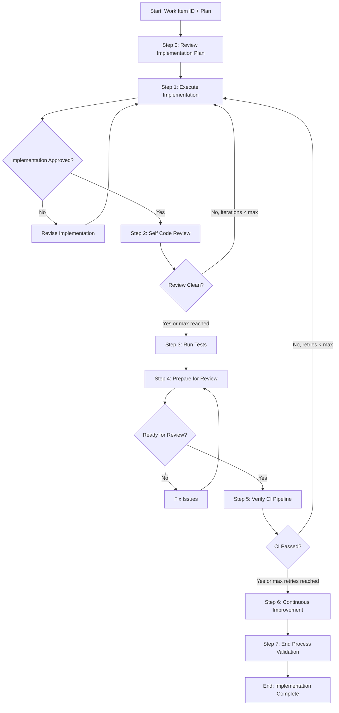

# Process: Implement Work Item {{workItemId}}

**Template**: implement-work-item
**Status**: Not Started

## Description

Implement an Azure DevOps work item based on an approved implementation plan. Reviews the plan, executes code changes following the plan's step order, runs a self code review loop for quality assurance, runs tests to verify no regressions, prepares clean commits for review, and verifies CI pipeline success before completing.

## Purpose & Usage

Use this template when you need to:
- Implement code changes for an ADO work item based on an existing plan
- Follow a structured implementation workflow with automated code review
- Verify CI pipeline passes after pushing changes
- Prepare changes for code review with clear commit history

**Not suitable for**: Exploratory prototyping, planning (use plan-work-item), or test-only changes.

## Quick Reference

| Parameter | Required | Description | Default |
|-----------|----------|-------------|---------|
| `workItemId` | Yes | Azure DevOps work item ID | — |
| `maxCodeReviewIterations` | No | Max code review → fix loop iterations | 3 |
| `maxCiRetries` | No | Max CI failure → fix loop iterations | 5 |

## Process Flow

## Steps Summary

| Step | Name | Approval | Loop |
|------|------|----------|------|
| 0 | Review Implementation Plan | No | — |
| 1 | Execute Implementation | Yes | — |
| 2 | Self Code Review | No | → Step 1 (max {{maxCodeReviewIterations}}) |
| 3 | Run Tests | No | — |
| 4 | Prepare for Review | Yes | — |
| 5 | Verify CI Pipeline | No | → Step 1 (max {{maxCiRetries}}) |
| 6 | Continuous Improvement | Yes | — |
| 7 | End Process Validation | No | — |
