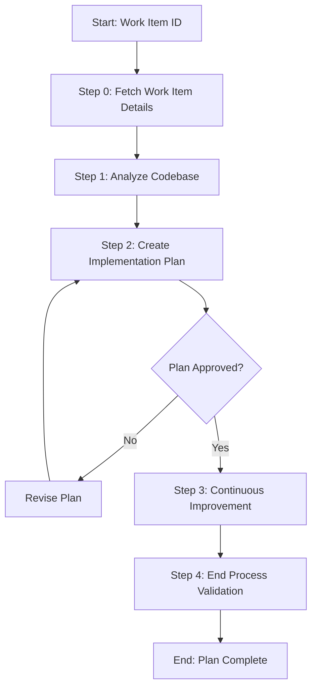

# Process: Plan Work Item {{workItemId}}

**Template**: plan-work-item
**Status**: Not Started

## Description

Create a detailed implementation plan for an Azure DevOps work item by fetching its details from ADO and analyzing the codebase to identify affected files, patterns, and dependencies.

## Purpose & Usage

Use this template when you need to:
- Create an implementation plan for an ADO work item
- Analyze codebase impact before starting implementation
- Document a structured approach with affected files, tasks, and testing strategy

**Not suitable for**: Direct implementation without planning, or documentation-only changes.

## Quick Reference

| Parameter | Required | Description |
|-----------|----------|-------------|
| `workItemId` | Yes | Azure DevOps work item ID |

## Process Flow

## Steps Summary

| Step | Name | Approval |
|------|------|----------|
| 0 | Fetch Work Item Details | No |
| 1 | Analyze Codebase | No |
| 2 | Create Implementation Plan | Yes |
| 3 | Continuous Improvement | Yes |
| 4 | End Process Validation | No |
