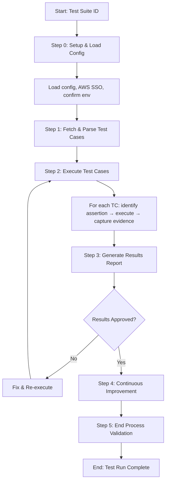

# Process: Run Test Suite for Work Item {{workItemId}}

**Template**: run-test-suite
**Status**: Not Started

## Description

Execute test cases from an ADO test suite with assertions on HTTP responses, MongoDB state, SQS queues, S3 objects, and Coralogix logs. Handles AWS SSO authentication per environment, captures evidence for each step, and generates a detailed test results report.

## Purpose & Usage

Use this template when you need to:
- Execute test cases from an ADO test suite against an environment
- Capture evidence (request/response JSON) for each test step
- Generate a test results report with pass/fail summary and evidence links

**Not suitable for**: Test case creation (use create-test-plan), unit test execution, or load/performance testing.

## Quick Reference

| Parameter | Required | Description |
|-----------|----------|-------------|
| `workItemId` | Yes | Azure DevOps work item ID |
| `testSuiteId` | No | ADO test suite ID (resolved from parent if not provided) |
| `testPlanId` | No | ADO test plan ID |
| `environment` | No | Target environment (e.g., dev, qa) |

## Process Flow

## Steps Summary

| Step | Name | Approval |
|------|------|----------|
| 0 | Setup & Load Config | No |
| 1 | Fetch & Parse Test Cases | No |
| 2 | Execute Test Cases | No |
| 3 | Generate Results Report | Yes |
| 4 | Continuous Improvement | Yes |
| 5 | End Process Validation | No |
