# Process: SDLC for Work Item {{workItemId}}

**Template**: sdlc
**Status**: Not Started

## Description

End-to-end SDLC orchestrator for Azure DevOps work items. Spawns sub-processes for each phase: planning, test planning, implementation, CD deployment to testing environments, test execution, and PR comment resolution. Each sub-process is a native agentic-processes template with its own steps, approval gates, memory, and logging.

## Purpose & Usage

Use this template when you need to:
- Implement an ADO work item (PBI, Bug, Feature) with full SDLC coverage
- Follow a structured development workflow with planning, testing, and implementation phases
- Ensure consistent quality and traceability across the development process

**Not suitable for**: Quick bug fixes without test plans or documentation-only changes.

## Quick Reference

| Parameter | Required | Description |
|-----------|----------|-------------|
| `workItemId` | Yes | Azure DevOps work item ID |

## Process Flow

```mermaid
flowchart TD
    A[Start: ADO Work Item ID] --> B[Step 0: Spawn plan-work-item]

    B --> B1[Sub-Process: plan-work-item]
    B1 --> B2[Fetch WI → Analyze Code → Create Plan]
    B2 --> B3{Plan Approved?}
    B3 -->|No| B2
    B3 -->|Yes| C[Step 1: Spawn create-test-plan]

    C --> C1[Sub-Process: create-test-plan]
    C1 --> C2[Config → Sniffing → Context → Test Cases → Push ADO]
    C2 --> C3{Test Plan Approved?}
    C3 -->|No| C2
    C3 -->|Yes| D[Step 2: Spawn implement-work-item]

    D --> D1[Sub-Process: implement-work-item]
    D1 --> D2[Review Plan → Implement → Test → Prepare]
    D2 --> D3{Implementation Approved?}
    D3 -->|No| D2
    D3 -->|Yes| CD[Step 3: Spawn deploy-to-testing]

    CD --> CD1[Sub-Process: deploy-to-testing]
    CD1 --> CD2[Load Config → Trigger CD → Monitor → Evaluate]
    CD2 --> CD3{Deployment Passed?}
    CD3 -->|No, retries < max| D
    CD3 -->|Yes or max retries reached| E[Step 4: Spawn run-test-suite]

    E --> E1[Sub-Process: run-test-suite]
    E1 --> E2[Setup → Fetch TCs → Execute → Report]
    E2 --> E3{Results Approved?}
    E3 -->|No| F[Fix & Re-run]
    F --> D
    E3 -->|Yes| PR[Step 5: Spawn fix-pr-comments]

    PR --> PR0[Step 0: Detect Repository]
    PR0 --> PR1[Step 1: Fetch PR & Comments]
    PR1 --> PR1a{Active Comments?}
    PR1a -->|None| PR6[Step 6: Continuous Improvement]
    PR1a -->|Yes| PR2[Step 2: Analyze & Plan Fixes]
    PR2 --> PR2a{Fix Plan Approved?}
    PR2a -->|No| PR2
    PR2a -->|Yes| PR3[Step 3: Implement Fixes]
    PR3 --> PR4[Step 4: Reply to Comments]
    PR4 --> PR5{Step 5: Await Reviewer Response\nPAUSED}
    PR5 -->|New comments arrived| PR1
    PR5 -->|PR approved / no more comments| PR6
    PR6 --> PR7[Step 7: End Process Validation]
    PR7 --> G[Step 6: Continuous Improvement]

    G --> H[Step 7: End Process Validation]
    H --> I[End: Work Item Complete]
```

## Steps Summary

| Step | Name | Sub-Process | Approval | Loop |
|------|------|-------------|----------|------|
| 0 | Plan Work Item | `sdlc/plan-work-item` | In sub-process | -- |
| 1 | Create Test Plan | `sdlc/create-test-plan` | In sub-process | -- |
| 2 | Implement Work Item | `sdlc/implement-work-item` | In sub-process | -- |
| **3** | **Deploy to Testing Environments** | **`sdlc/deploy-to-testing`** | **In sub-process** | **-> Step 2 (max 3)** |
| 4 | Run Test Suite | `sdlc/run-test-suite` | In sub-process | -- |
| 5 | Fix PR Comments | `sdlc/fix-pr-comments` | In sub-process | -- |
| 6 | Continuous Improvement | -- | Yes | -- |
| 7 | End Process Validation | -- | No | -- |
